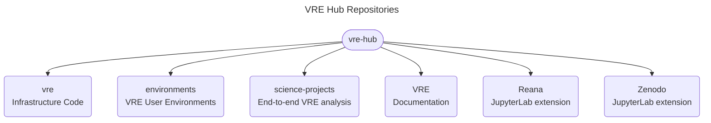

## Virtual Research Environment

The Virtual Research Environment is an analysis platform developed at CERN serving the needs of scientific communities involved in European Projects. Its scope is to facilitate the development of end-to-end physics workflows, providing researchers with access to an infrastructure and to the digital content necessary to produce and preserve a scientific result in compliance with FAIR principles. The platform’s development is aimed at demonstrating how sciences spanning from :collision: High Energy Physics :sparkles: to :satellite: Astrophysics :telescope: could benefit from the usage of common technologies, initially born to satisfy CERN’s exabyte-scale data management needs.

👩‍💻 Find the VRE documentation and overview [here](https://vre-hub.github.io/).  
🌈 Any contribution is welcome! Feel free to create issues and start discussions! Find our wiki [here](https://github.com/vre-hub/vre/wiki).  

*The platform development effort is part of the [ESCAPE](https://projectescape.eu/), [EOSC Future](https://eoscfuture.eu), and [OSCARS](https://oscars-project.eu/) EU-funded projects implementing the European Open Science Cloud (EOSC).*
